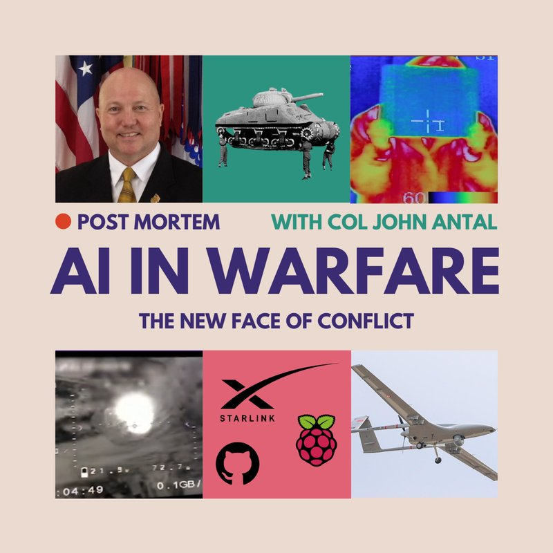
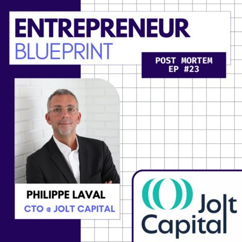
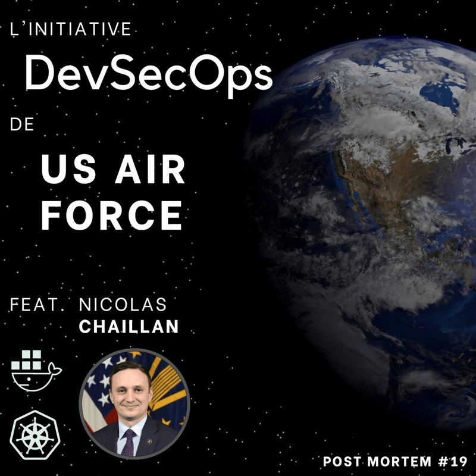

  

## Building [AlexandrIA](https://tryalexandria.fr) · Fractional Head of AI

I ship AI products that people actually use. I founded and operate [AlexandrIA](https://tryalexandria.fr), a research co-pilot that turns messy questions into visual knowledge maps and client-ready deliverables. On the side I take a **very small number** of Fractional Head of AI mandates with post-seed startups that need someone to own the AI vision and make it real in production.

### AlexandrIA

Live product: [tryalexandria.fr](https://tryalexandria.fr) · [status](https://status.tryalexandria.fr/status/aia)

Knowledge workers use it to frame a problem, curate sources, and package insights. It is in production, with billing, EU hosting, and a public changelog. Built and operated end-to-end: product, AI, and infra.

### Fractional Head of AI

For post-seed teams that already have a product and need an AI lead who has shipped, not a slide deck. I help set the roadmap, choose the stack, and stay close to delivery. Capacity is intentionally limited.

### What I actually work in

Production LLM products, agents, RAG, knowledge graphs, and the infra that keeps them up.

- **Product / AI:** TypeScript, Next.js, Python, FastAPI, agent runtimes, tool-calling, RAG, LLM gateways (OpenAI-compatible), observability
- **Data / backend:** Postgres, Supabase, object storage
- **Ship & operate:** Docker, CI, Ansible, EU cloud (OVHcloud, Scaleway), Cloudflare
- **Also in the field:** leading the AI dimension on a production operations assistant (RAG, agents, knowledge graphs, air-gapped deployments)

I do not train computer-vision models in PyTorch day to day. I design, ship, and run LLM systems.

### Background

Centrale Nantes, MSc Signal Processing & Statistics. Engineering manager and ML engineer at the French DoD, then Schneider Electric and Kpler. Now founder of AlexandrIA, and AI lead on client production systems.

Guest Lecturer, LLM Pretraining & Post-training, [SCAI](https://scai.sorbonne-universite.fr/) (Sorbonne Université) & Centrale Nantes.

### Teaching & speaking

Guest lecturer on LLM pretraining and post-training at [SCAI](https://scai.sorbonne-universite.fr/) (Sorbonne Université) and Centrale Nantes.

Selected talks: [TensorFlow World](https://fpaupier.fr/201910_tensorflow_world) (Santa Clara, 2019) · [AGIR 2024](https://fpaupier.fr/202411_agir_dggn) for the Gendarmerie Nationale (LLM industrialization panel) · GenAI delivery at Qonto HQ (2025) · LLM sovereignty & supply chains, Centrale Nantes (2025). Catalog: [fpaupier.fr/speaking](https://fpaupier.fr/speaking.html)

### Post Mortem

I created, produced, and hosted [Post Mortem](https://creators.spotify.com/pod/profile/podcastmortem/) for four years as producer and interviewer. Engineers walk through real incidents: outages, cyber, ML in production. 24 episodes, 2020–2024. On hold while I focus on shipping.

<table>
  <tr>
    <td width="33%" valign="top" align="center">
       
      <a href="https://podcasters.spotify.com/pod/show/podcastmortem/episodes/24-The-New-Face-of-Conflict-AI-in-Warfare-with-COL-ANTAL-e2f9007"><strong>#24 AI in warfare</strong></a> 
      COL John Antal · 60 min
    </td>
    <td width="33%" valign="top" align="center">
       
      <a href="https://podcasters.spotify.com/pod/show/podcastmortem/episodes/23-Dentrepreneur--investisseur---le-parcours-de-Philippe-Laval-e2046tf"><strong>#23 From founder to investor</strong></a> 
      Philippe Laval · Sinequa, Jolt Capital
    </td>
    <td width="33%" valign="top" align="center">
       
      <a href="https://podcasters.spotify.com/pod/show/podcastmortem/episodes/19-Le-DevSecOps--lUS-Air-Force-e1mqvem"><strong>#19 DevSecOps at the US Air Force</strong></a> 
      Nicolas Chaillan · 31 min
    </td>
  </tr>
</table>

Catalog: [Spotify](https://open.spotify.com/show/6UpnjZcPwJDBRXUMRUSxZZ) · [notes](https://fpaupier.fr/post_mortem_podcast) · [Apple Podcasts](https://podcasts.apple.com/fr/podcast/post-mortem/id1535752959)

### Writing

I wrote a run of how-to pieces ([Medium](https://medium.com/@francois.paupier), [fpaupier.fr/writings](https://fpaupier.fr/writings.html)). Not currently writing. Focused on execution.

<table>
  <tr>
    <td width="33%" valign="top" align="center">
       
      <a href="https://medium.com/free-code-camp/nifi-surf-on-your-dataflow-4f3343c50aa2"><strong>How Apache NiFi works</strong></a> 
      freeCodeCamp · 1.3k claps
    </td>
    <td width="33%" valign="top" align="center">
       
      <a href="https://medium.com/@francois.paupier/unleash-multiprocessing-with-python-and-grpc-795bc2957d0a"><strong>Multiprocessing with Python and gRPC</strong></a> 
      Medium
    </td>
    <td width="33%" valign="top" align="center">
       
      <a href="https://medium.com/@francois.paupier/how-to-communicate-effectively-to-a-non-technical-stakeholder-e09bcd0e49d2"><strong>Talking to non-technical stakeholders</strong></a> 
      Medium
    </td>
  </tr>
</table>

Also: [Taxonomy of leading Generative AI architectures](https://fpaupier.fr/202406_genai_taxonomy) (2024) · [Practical insights for LLM fine-tuning and evaluation](https://fpaupier.fr/assets/20240228_Practical%20insights%20for%20LLM%20fine-tuning%20and%20evaluation.pdf) (2024) · [Effective domain modeling](https://medium.com/@francois.paupier/effective-domain-modeling-170ad3972fb6)

### Connect

[LinkedIn](https://linkedin.com/in/fpaupier) · [tryalexandria.fr](https://tryalexandria.fr) · [fpaupier.fr](https://fpaupier.fr)

--------

#### Credits

Banner designed using the [github profile header generator](https://leviarista.github.io/github-profile-header-generator/),
octocat shaped with the [myOctocat creator](https://myOctocat.com/).
