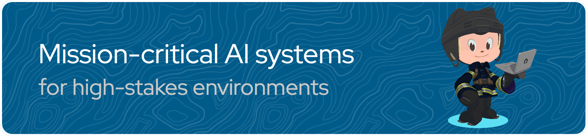

  

## Building [AlexandrIA](https://tryalexandria.fr) · Fractional Head of AI

I ship AI products that people actually use. I founded and operate [AlexandrIA](https://tryalexandria.fr), a research co-pilot that turns messy questions into visual knowledge maps and client-ready deliverables. On the side I take a **very small number** of Fractional Head of AI mandates with post-seed startups that need someone to own the AI vision and make it real in production.

### AlexandrIA

Live product: [tryalexandria.fr](https://tryalexandria.fr) · [status](https://status.tryalexandria.fr/status/aia)

Knowledge workers use it to frame a problem, curate sources, and package insights. It is in production, with billing, EU hosting, and a public changelog. Built and operated end-to-end: product, AI, and infra.

### Fractional Head of AI

For post-seed teams that already have a product and need an AI lead who has shipped, not a slide deck. I help set the roadmap, choose the stack, and stay close to delivery. Capacity is intentionally limited.

### What I actually work in

Production LLM products, agents, RAG, knowledge graphs, and the infra that keeps them up.

- **Product / AI:** TypeScript, Next.js, Python, FastAPI, agent runtimes, tool-calling, RAG, LLM gateways (OpenAI-compatible), observability
- **Data / backend:** Postgres, Supabase, object storage
- **Ship & operate:** Docker, CI, Ansible, EU cloud (OVHcloud, Scaleway), Cloudflare
- **Also in the field:** leading the AI dimension on a production operations assistant (RAG, agents, knowledge graphs, air-gapped deployments)

I do not train computer-vision models in PyTorch day to day. I design, ship, and run LLM systems.

### Background

Centrale Nantes, MSc Signal Processing & Statistics. Engineering manager and ML engineer at the French DoD, then Schneider Electric and Kpler. Now founder of AlexandrIA, and AI lead on client production systems.

### Connect

[LinkedIn](https://linkedin.com/in/fpaupier) · [tryalexandria.fr](https://tryalexandria.fr) · [fpaupier.fr](https://fpaupier.fr)

--------

#### Credits

Banner designed using the [github profile header generator](https://leviarista.github.io/github-profile-header-generator/),
octocat shaped with the [myOctocat creator](https://myOctocat.com/).
